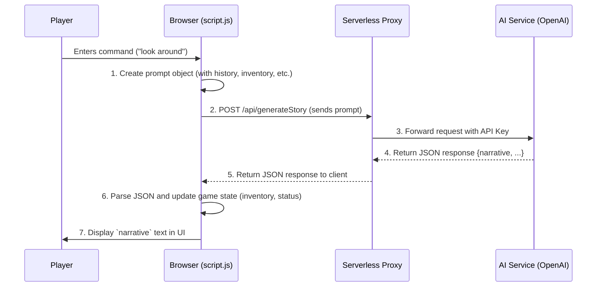
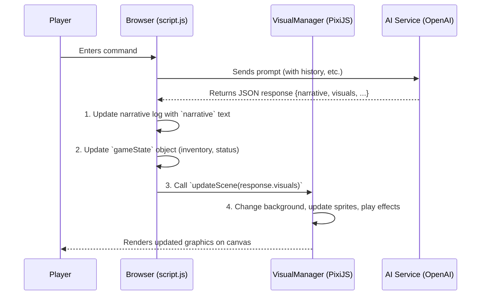

# UI Design Proposal for "Casino For Real"

## 1. Core Concepts & Philosophy

The goal is to elevate the existing text-based game into a visually striking and immersive experience, reminiscent of a "triple-A" indie title. The design philosophy is "Neon-Noir," blending the dark, gritty atmosphere of a supernatural casino with the vibrant, electric glow of Las Vegas at midnight.

The primary interaction model will shift from simple button clicks to a command-line parser. This encourages deeper player engagement and aligns with the classic text-adventure genre, while the UI will provide modern affordances to make it accessible.

---

## 2. Layout

The proposed layout is a single-screen interface, moving away from the simple two-column split. This creates a more cohesive and application-like feel.

```mermaid
graph TD
    A[Game UI] --> B(Header: 'Casino For Real');
    A --> C{Main Content Area};
    A --> F(Input Area);

    subgraph Main Content Area
        C --> D[Narrative Log];
        C --> E[Status Panel];
    end

    subgraph Input Area
        F --> G[Command Input: '> _'];
    end

    style B fill:#111,stroke:#0ff,stroke-width:2px
    style D fill:#1a1a1a,stroke:#333,stroke-width:1px
    style E fill:#1a1a1a,stroke:#333,stroke-width:1px
    style G fill:#111,stroke:#0ff,stroke-width:1px
```



*   **Header:** A slim, persistent header containing the game's title.
*   **Main Content Area:** This area is split into two main sections:
    *   **Narrative Log (Left, 70% width):** A scrolling window where all story text, actions, and results are displayed chronologically. Unlike the current design where text is replaced, new text will be appended, allowing the player to review their journey.
    *   **Status Panel (Right, 30% width):** A dedicated area for all player-related information.
*   **Input Area:** A fixed section at the bottom of the screen for player commands.

---

## 3. Component Breakdown

### a. Narrative Log

*   **Functionality:** This is the primary display for the game's story. It will show scene descriptions, character dialogue, and the results of player actions.
*   **Appearance:** Text will appear with a subtle fade-in or "typing" effect to enhance immersion. Important keywords or items within the text could be highlighted with the accent color to suggest interactivity (e.g., "You see a shimmering **deck of cards** on the table.").

### b. Command Input

*   **Functionality:** Replaces the current choice buttons with a text input field. The game's JavaScript engine would need to be updated to parse simple commands (e.g., `look around`, `take key`, `talk to dealer`, `go to slots`).
*   **Appearance:** Styled to look like a classic terminal prompt, with a blinking cursor.
    *   Example: `> _`
*   **Enhancements:** To maintain accessibility, available commands or keywords from the scene description could be subtly suggested to the player, perhaps appearing as clickable elements in the narrative log or as ghost text in the input field.

### c. Status Panel

This panel will be a complete overhaul of the current sidebar, using icons and better visual organization.

*   **Inventory:**
    *   **Appearance:** A grid-based layout. Each item is represented by an icon. Hovering over an icon would reveal its name and description in a tooltip.
    *   **Example:** A key icon for the "Motel room key," a ticket stub icon for the "Grateful Dead ticket."
*   **Family Status:**
    *   **Appearance:** This section will display the status of each family member. Each member would have a small portrait or silhouette.
    *   **States:**
        *   **Trapped:** The portrait is grayscale and has a "static" or "glitch" effect overlay.
        *   **Rescued:** The portrait is in full color and clear.
*   **Flashbacks / Lore:**
    *   **Appearance:** Unlocked lore items or flashbacks could be collected here, represented by icons or titles that, when clicked, open a modal or overlay to display the full text.

---

## 4. Visual Theme: Neon-Noir

*   **Color Palette:**
    *   **Background:** A very dark charcoal/obsidian (`#111111`).
    *   **UI Panels:** A slightly lighter dark gray (`#1c1c1c`).
    *   **Primary Text:** A soft, off-white (`#e0e0e0`) for readability.
    *   **Accent/Interactive:** A vibrant, glowing cyan (`#00ffff`) or magenta (`#ff00ff`). This will be used for borders, interactive text, icons, and the command prompt to create a striking contrast.
*   **Typography:**
    *   **Narrative & UI Text:** A clean, modern sans-serif font like `Inter` or `Roboto`.
    *   **Command Input/Output:** A monospaced font like `Roboto Mono` or `Fira Code` to reinforce the terminal aesthetic.
*   **Effects:**
    *   **Glow:** The accent color should have a subtle `text-shadow` or `box-shadow` to create a neon glow effect.
    *   **Scan Lines:** A faint, optional scan-line overlay on the entire UI could enhance the "digital" or "unreal" feeling of the casino.

---

## 5. Next Steps

This design document outlines a comprehensive visual and functional overhaul for the game. The next logical step is to begin implementation. This would involve:

1.  Restructuring the `index.html` file to match the new layout.
2.  Writing new CSS to implement the "Neon-Noir" theme.
3.  Updating the JavaScript game engine to support a command-line parser instead of the current button-based choice system.

I recommend switching to **Code Mode** to begin applying these changes.
---

# 6. AI Storyline Integration Architecture

This section outlines the technical design for integrating a generative AI to create a dynamic, evolving storyline for "Casino For Real".

## a. AI Service Recommendation

For generating dynamic story content, we recommend using the **OpenAI API (specifically, the GPT-4 or newer models)**.

*   **Justification:**
    *   **High-Quality Narrative Generation:** OpenAI's models are exceptionally proficient at creative writing, understanding context, and maintaining a consistent tone, which is crucial for our "Neon-Noir" theme.
    *   **Flexible API:** The API is well-documented and supports structured JSON output, which will allow us to receive not just narrative text, but also game state changes (e.g., new items, status updates).
    *   **Community & Support:** Extensive community support and examples are available, simplifying development.

An alternative would be **Google's Gemini Pro**, which also has strong capabilities and a competitive API. However, OpenAI's models currently have an edge in creative, long-form storytelling for this specific genre.

## b. Prompt Engineering Strategy

To ensure coherent and context-aware responses from the AI, we will send a structured prompt with each request. The prompt will be a JSON object sent to the AI, containing the essential context of the game.

**Core Prompt Structure:**

```json
{
  "system_prompt": "You are the game master for 'Casino For Real', a text-based adventure set in a surreal, neon-noir casino. Your tone is mysterious, descriptive, and slightly unsettling. The player is trying to rescue their family from the casino's supernatural grip. Generate a response that describes the outcome of the player's action. Your response must be in JSON format with three keys: 'narrative' (the story text), 'inventory' (an array of items the player now has), and 'status' (a brief update on the family's situation).",
  "story_history": [
    "You find yourself in a casino that feels... wrong. The air is thick with smoke and something else, something electric. Your head hurts.",
    "> look around",
    "The casino floor is a dizzying maze of neon and shadows. A bar glows in the corner, and the hum of slot machines is a constant drone. You see a deck of cards on a nearby table."
  ],
  "current_command": "take deck of cards",
  "current_inventory": [],
  "family_status": "Status Unknown"
}
```

*   **`system_prompt`:** A one-time instruction that sets the AI's persona and the rules of the game.
*   **`story_history`:** An array containing the last 4-6 exchanges to give the AI immediate context. This prevents the prompt from growing too large while maintaining the thread of the story.
*   **`current_command`:** The exact command the player just typed.
*   **`current_inventory`:** An array of items the player is currently holding.
*   **`family_status`:** The current known status of the player's family.

## c. Application Flow

The existing `processCommand` function in `script.js` will be refactored to handle asynchronous API calls to the AI service.



**Workflow Steps:**

1.  Player enters a command.
2.  `script.js` captures the command.
3.  It constructs the prompt object using the current game state.
4.  It makes an `async fetch` call to our backend proxy endpoint.
5.  It displays a "thinking..." or loading indicator in the UI.
6.  When the response is received, it parses the JSON.
7.  It updates the `gameState` object with the new inventory and status.
8.  It appends the `narrative` text to the narrative log.
9.  It updates the Status Panel in the UI to reflect the new state.

## d. State Management

All game state will be managed client-side in a single JavaScript object. This keeps the logic simple and contained.

**`gameState` Object Structure:**

```javascript
// To be defined at the top of script.js
let gameState = {
    storyHistory: [],
    inventory: [],
    familyStatus: "Status Unknown",
    lore: []
};
```

*   **`storyHistory`:** An array of strings that logs the narrative and player commands. It will be trimmed periodically to manage its size for the AI prompt.
*   **`inventory`:** An array of strings representing the items the player possesses.
*   **`familyStatus`:** A string or object describing the current situation with the family.
*   **`lore`:** An array for collected flashbacks or lore entries.

This object will be the single source of truth for the game's state and will be used to build the AI prompt and update the UI.

## e. API Key Management

**It is critical that the AI service API key is never exposed in the client-side JavaScript code.**

To secure the key, we will use a **serverless function as a proxy**.

*   **How it works:**
    1.  The client-side `script.js` does **not** know the API key. It only knows the URL of our serverless function (e.g., `https://vegas-game.netlify.app/api/generateStory`).
    2.  We create a simple serverless function (e.g., using Netlify Functions, Vercel Functions, or AWS Lambda).
    3.  The AI API key is stored as a secure **environment variable** in the serverless hosting provider's settings.
    4.  The serverless function receives the prompt from the client, attaches the API key from its environment variables, and forwards the request to the AI service.
    5.  It then returns the AI's response back to the client.

This approach ensures the API key remains secret and provides a control point for rate-limiting or logging, if needed in the future.

---

# 7. Visual Enhancement & Graphics Integration

This section outlines a major enhancement to the "Casino For Real" project, building upon the established "Neon-Noir" text-adventure foundation. The goal is to introduce a dynamic 2D visual layer, transforming the game into a professional, Steam-quality graphical experience while retaining its rich, AI-driven narrative core.

## a. UI Redesign with Visuals

The core layout will be updated to accommodate a dedicated visual scene, providing players with a window into the game world. The text-based narrative log remains a crucial component, now working in concert with the visuals.

```mermaid
graph TD
    A[Game UI] --> B(Header: 'Casino For Real');
    A --> H{Visual Scene};
    A --> C{Main Content Area};
    A --> F(Input Area);

    subgraph Main Content Area
        C --> D[Narrative Log];
        C --> E[Status Panel];
    end

    subgraph Input Area
        F --> G[Command Input: '> _'];
    end

    style H fill:#000,stroke:#0ff,stroke-width:2px,stroke-dasharray: 5 5
    style B fill:#111,stroke:#0ff,stroke-width:2px
    style D fill:#1a1a1a,stroke:#333,stroke-width:1px
    style E fill:#1a1a1a,stroke:#333,stroke-width:1px
    style G fill:#111,stroke:#0ff,stroke-width:1px
```



*   **Visual Scene (New):** A prominent canvas at the top of the main content area where all graphics will be rendered. This will display the current location, characters, and effects.
*   **Narrative Log:** Functions as before, but now its descriptions will be visually represented in the scene above it.
*   **Status Panel & Input Area:** Remain unchanged in their function.

## b. Dynamic Visuals

A library of 2D assets will be created to bring the "Neon-Noir" world to life.

*   **Background Scenes:** High-quality, atmospheric images for each key location (e.g., the main casino floor, a dimly lit backroom, the ethereal motel). These may include subtle animations like flickering lights or drifting smoke to enhance immersion.
*   **Character Sprites:** 2D character art for the player and NPCs (the dealer, other patrons, family members). Sprites should have multiple states or simple animations (e.g., idle, talking, performing an action) to react to game events.
*   **Item Icons:** As described previously, icons will represent inventory items. These can now also be rendered in the main visual scene when relevant (e.g., an item on a table).
*   **Visual Effects (VFX):** A range of particle effects and shaders will be used to provide feedback and create atmosphere. Examples include:
    *   A neon glow on magical items.
    *   A "glitch" or "static" effect on characters or scenes to represent the casino's supernatural influence.
    *   Particle effects for card games, slot machine payouts, or other key events.

## c. Technology Recommendation

For rendering 2D graphics, we recommend using **PixiJS**.

*   **Justification:**
    *   **High Performance:** PixiJS is a WebGL renderer with a canvas fallback, ensuring smooth animations and effects even with many objects on screen.
    *   **Lightweight & Focused:** It is not a full game engine. It focuses solely on being the best 2D renderer possible. This is ideal for our project, as the core game logic is already handled by our custom JavaScript and AI backend. We don't need the bloat of a full physics engine or complex state management systems that a library like Phaser would include.
    *   **Ease of Integration:** It can be easily integrated into the existing DOM structure. We can create a `<canvas>` element for PixiJS to draw on, while the rest of our UI (narrative log, status panel) remains standard HTML and CSS. This separation of concerns is clean and maintainable.
    *   **Strong Community:** PixiJS has a large, active community and excellent documentation.

## d. Integration Plan

The new visual system will be driven by the existing AI game logic. The `script.js` file will be modified to update the visual scene in response to AI-driven events.

**1. Extend the AI Response:**

The JSON response from the AI service will be extended to include a `visuals` object, which will explicitly command the rendering engine.

**Example Extended AI Response:**
```json
{
  "narrative": "The dealer shuffles the deck with an unnerving grin. A faint purple glow emanates from the cards.",
  "inventory": ["deck of cards"],
  "status": "The dealer seems amused.",
  "visuals": {
    "background": "casino_floor_dark",
    "characters": [
      { "name": "dealer", "action": "shuffle_cards" }
    ],
    "effects": [
      { "type": "glow", "target": "dealer", "color": "purple" }
    ]
  }
}
```

**2. Update the Application Flow:**

The `handleAIResponse` function in `script.js` will become the central point for synchronizing the game's state, narrative, and visuals.



**3. Implementation in `script.js`:**

*   A new `VisualManager` module/class will be created to encapsulate all PixiJS-related code (app setup, asset loading, scene updates).
*   On startup, `VisualManager.init()` will be called to create the PixiJS application and load initial assets.
*   The `handleAIResponse` function will be modified:
    ```javascript
    function handleAIResponse(command, data) {
        // ... (existing code to update history and narrative log)

        // Update game state
        gameState.inventory = data.inventory || gameState.inventory;
        gameState.familyStatus = data.status || gameState.familyStatus;
        updateStatusPanel(); // A new function to refresh the status UI

        // Update visuals
        if (data.visuals) {
            VisualManager.updateScene(data.visuals);
        }
    }
    ```
*   The `VisualManager.updateScene(visuals)` function will contain the logic to interpret the `visuals` object and translate it into PixiJS commands (e.g., `setBackground('casino_floor_dark')`, `getSprite('dealer').playAnimation('shuffle_cards')`).